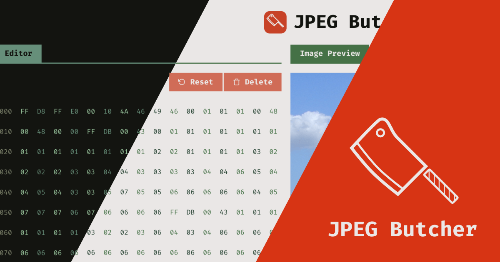

<div align="center">
  
  <br />
  <h1><a href="https://jpeg-butcher.sascha.app/" rel="noopener noreferrer">JPEG Butcher</a></h1>
  <strong>📷🗒️ A hex editor for JPEG images. Change the looks of an image by altering the value of a random byte or simply click the reset button when you've gone too far.</strong>
  <br />
  <br />
  <a href="https://github.com/saschazar21/jpeg-butcher/actions/workflows/deploy-to-netlify.yml"></a> <a href="https://github.com/saschazar21/jpeg-butcher/actions/workflows/build-and-test.yml"></a> 
  <br />
  <br />
  
  <br />
  <br />
  <br />
</div>

## About

This repository contains the source code for [jpeg-butcher.sascha.app](https://jpeg-butcher.sascha.app), a project for manipulating JPEG files using a hex editor.

### Privacy

Images uploaded to the website will never leave the browser and stay cached entirely on each local device for the duration of the usage of the website. There is neither any data transfer happening to third-party servers, nor does the original server process any data from those images. In fact, the website is even purely offline accessible—so once opened on the local device, the website won't need any communication to its hosting server, other than occasionally fetching updates for website assets (e.g. logos, icons, etc...).

ℹ️ EXIF data is removed due to privacy reasons!

## How it works

This project demonstrates how a JPEG file is constructed using [_JPEG markers_](https://github.com/corkami/formats/blob/master/image/jpeg.md#diagrams), as well as the effects, when altering the values of different byte values. By default, only the first **384 bytes** are shown — for legibility & performance reasons.

Below is a table, which should support in gaining a first overview, of which JPEG markers to keep looking for:

### JPEG Markers

This table can be found on [Wikipedia](https://en.wikipedia.org/wiki/JPEG#Syntax_and_structure).

ℹ️ EXIF markers are removed due to privacy reasons!

The _variable_ byte size is indicated by 2 bytes following the respective JPEG marker, e.g. `FF C4 01 A2` indicates a 418-byte Huffman table (`0x01a2` in hexadecimal equals a value of `418` in decimal).

| Short name | Bytes                  | Payload    | Name                         | Description                                                                                     |
| ---------- | ---------------------- | ---------- | ---------------------------- | ----------------------------------------------------------------------------------------------- |
| **SOI**    | `0xFF` `0xD8`          | _none_     | Start Of Image               | First marker in a valid JPEG file                                                               |
| **SOF0**   | `0xFF` `0xC0`          | _variable_ | Start Of Frame (baseline)    | JPEG file is baseline-encoded                                                                   |
| **SOF2**   | `0xFF` `0xC2`          | _variable_ | Start Of Frame (progressive) | JPEG file is progressive-encoded                                                                |
| **DHT**    | `0xFF` `0xC4`          | _variable_ | Define Huffman Table         | Huffman table for lossless compression                                                          |
| **DQT**    | `0xFF` `0xDB`          | _variable_ | Define Quantization Table    | Quantization table for lossy compression                                                        |
| **DRI**    | `0xFF` `0xDD`          | 4 bytes    | Define Restart Interval      | Defines byte interval for RST marker                                                            |
| **RST**_n_ | `0xFF` `0xDn` (n=0..7) | _none_     | Restart                      | Incremental reset index for data chunks, indicator for data integrity                           |
| **SOS**    | `0xFF` `0xDA`          | _variable_ | Start Of Scan                | Top-to-bottom scan, baseline is generally a single scan, progressive may contain multiple scans |
| **APP**_n_ | `0xFF` `0xEn`          | _variable_ | Application-specific         | Contains meta information like JFIF-header, EXIF-information, etc...                            |
| **COM**    | `0xFF` `0xFE`          | _variable_ | Comment                      | Placeholder for textual comment                                                                 |
| **EOI**    | `0xFF` `0xD9`          | _none_     | End Of Image                 | Last marker in a valid JPEG file, marks end of file                                             |

### Manipulating Values

Generally speaking, there is no real strategy for how to gain certain effects by changing specific values. Mostly it's a hit or miss—although each image may be reset to its initial state for starting over again. Omar Shehata provides some information in his article [Unraveling the JPEG](https://parametric.press/issue-01/unraveling-the-jpeg/) for getting started.

The safest way of experimenting with different values is looking for a Huffman table marker (`FF C4`) and start changing payload values greater than 10 or so...

ℹ️ Whenever the preview image becomes invisible, the byte values have been changed to a state, where they are corrupting the image so that it's not decodeable anymore.

## Build Setup

```bash
# install dependencies
$ yarn install

# serve with hot reload at localhost:3000
$ yarn start

# build for production and launch server
$ yarn build
$ yarn serve
```

## Contribution

This is very much a hacky project and could use some formatting-, testing- and documentation love. Feel free to reach out, if you're interested.

## Credits

This project was heavily influenced by [Omar Shehata](https://omarshehata.me/)'s blog post [Unraveling the JPEG](https://parametric.press/issue-01/unraveling-the-jpeg/).

## License

Licensed under the MIT license.

Copyright ©️ 2021 [Sascha Zarhuber](https://sascha.work)
